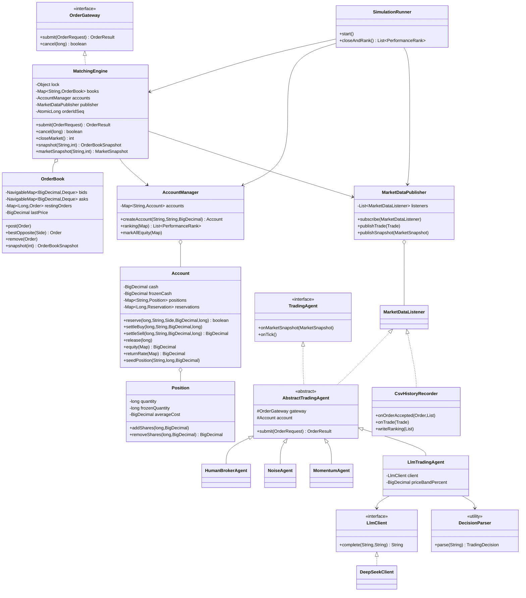
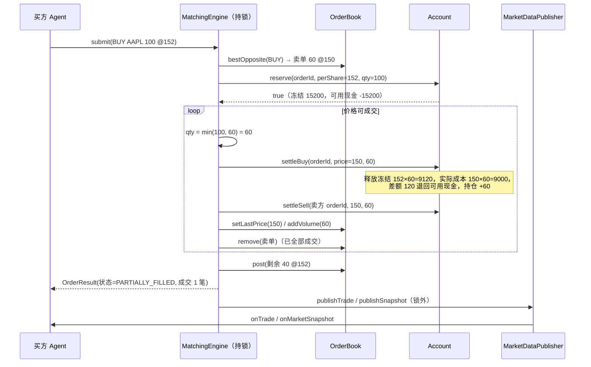
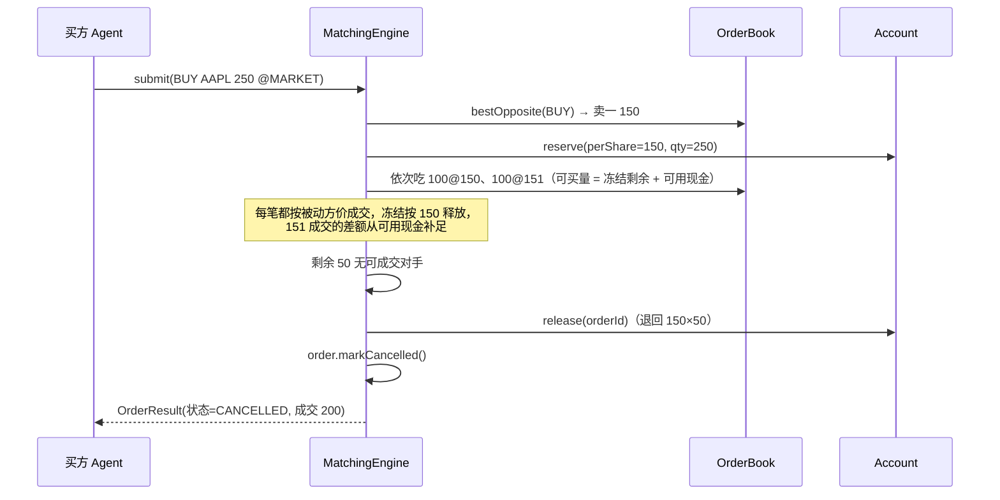
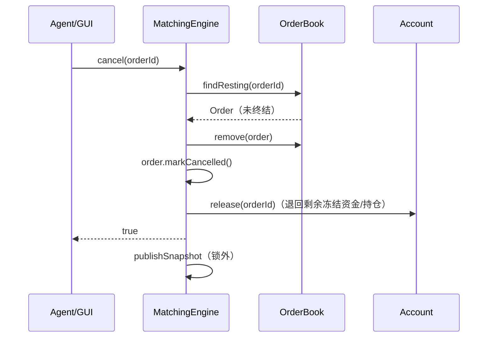
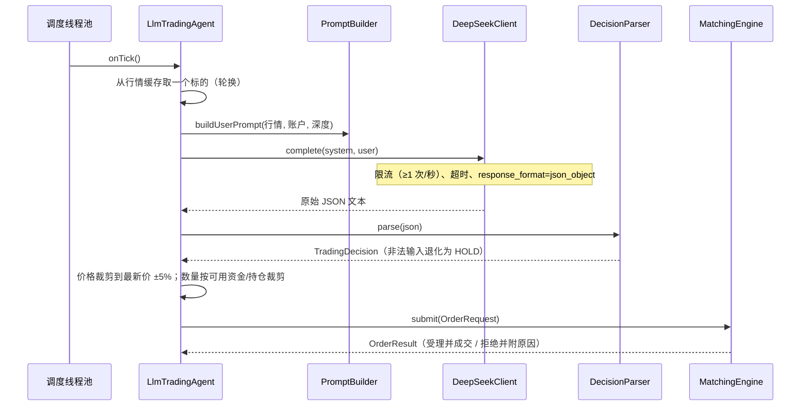

# 02 系统架构设计

## 1. 分层与包结构

```
gui / app            表现层：JavaFX 界面、控制台演示
  └─ sim             装配层：SimulationRunner 组装引擎/账户/agent/定时器，驱动交易周期
       └─ engine     业务层：MatchingEngine（撮合）、OrderBook（订单簿）
          ├─ account 业务层：Account / AccountManager / PerformanceTracker
          ├─ market  业务层：MarketDataPublisher / MarketDataListener（行情广播）
          └─ agent   业务层：TradingAgent 及实现（人类、AI/LLM、噪音做市）
               └─ io / config / model   数据层：CSV 落盘、配置加载、不可变领域对象
```

依赖方向单向向下：`gui/app → sim → engine|account|market|agent → model`。
agent 只依赖 `OrderGateway` 接口，不接触引擎内部结构，便于替换与测试。

## 2. 类图



## 3. 时序图

### 3.1 限价买单与挂单卖单成交（含部分成交与价格改善）



### 3.2 市价单扫簿与剩余撤销



### 3.3 撤单



### 3.4 LLM 决策周期



## 4. 线程模型（对应规格 4.4）

| 线程 | 职责 | 说明 |
| --- | --- | --- |
| 主线程 | 装配 `SimulationRunner`、启动 GUI | 不参与撮合 |
| 调度线程池（`ScheduledExecutorService`） | 按各自间隔调用 `agent.onTick()` | agent 真并发，直接冲击引擎的线程安全设计 |
| 权益标记任务 | 每秒 `AccountManager#markAllEquity` | 维护最大回撤曲线 |
| JavaFX 线程 | 渲染与交互 | 行情回调里只做 `Platform.runLater` |
| 收尾 | `closeAndRank`：停调度 → 收盘撤单 → 排行榜落盘 | 顺序固定，避免收盘后仍有下单 |

### 锁与并发约定

1. **单锁撮合**：校验、冻结、撮合、记账、改簿全在 `MatchingEngine.lock` 内完成，
   等价于规格要求的 “`submitOrder()` 必须 synchronized”，保证状态变更串行化。
2. **锁顺序固定**：引擎锁 → 账户锁。账户层不回调引擎，因此不存在反向加锁，不会死锁。
3. **锁外副作用**：行情广播、CSV 落盘在锁外执行，监听者慢 I/O 不会拖住撮合；
   监听者抛异常只计数不中断撮合（`MarketDataPublisher#getListenerErrorCount`）。
4. **每次决策只处理一个标的**：AI agent 每 tick 只对一个标的调一次 LLM，控制额度与并发。

## 5. 关键不变量（测试覆盖）

| 不变量 | 覆盖测试 |
| --- | --- |
| 成交价取被动方价格，买方获得价格改善 | `matchesAtRestingPrice` |
| 同价按时间优先、不同价按价格优先 | `samePriceRespectsTimePriority`、`betterPriceTakesPrecedence` |
| 撮合后订单簿不交叉（bestBid < bestAsk） | `concurrentSubmissionsKeepInvariants` |
| 资金守恒：现金 + 成本基础 = 期初 + 已实现盈亏 | `cashAndCostBasisAreConserved`、`concurrentSubmissionsKeepInvariants` |
| 撤单/收盘后冻结全部释放、可用现金恢复 | `cancelReleasesFrozenCash`、`closedMarketRejectsOrders` |
| 资金/持仓不足被拒绝且无副作用 | `buyRejectedWhenInsufficientCash`、`sellRejectedWhenInsufficientShares` |
| 多标的互不干扰 | `multiSymbolBooksAreIsolated` |
| 并发下无重复订单号、金额不为负 | `concurrentSubmissionsKeepInvariants` |
| 收益率不把初始持仓误算为收益 | `seededHoldingsDoNotInflateReturnRate` |
| 端到端：真起线程产生成交并落盘 | `SimulationIntegrationTest` |
